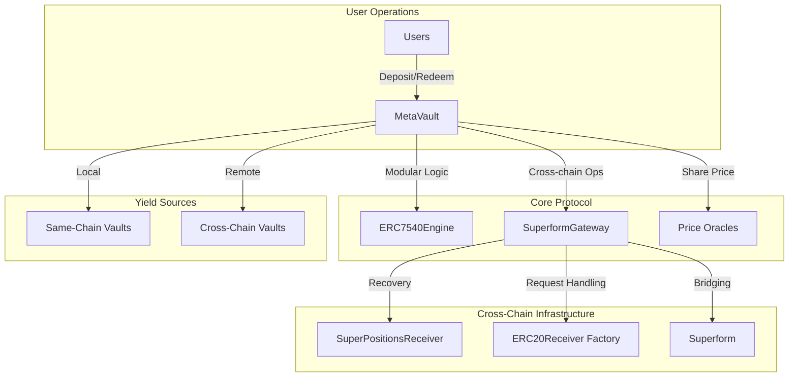
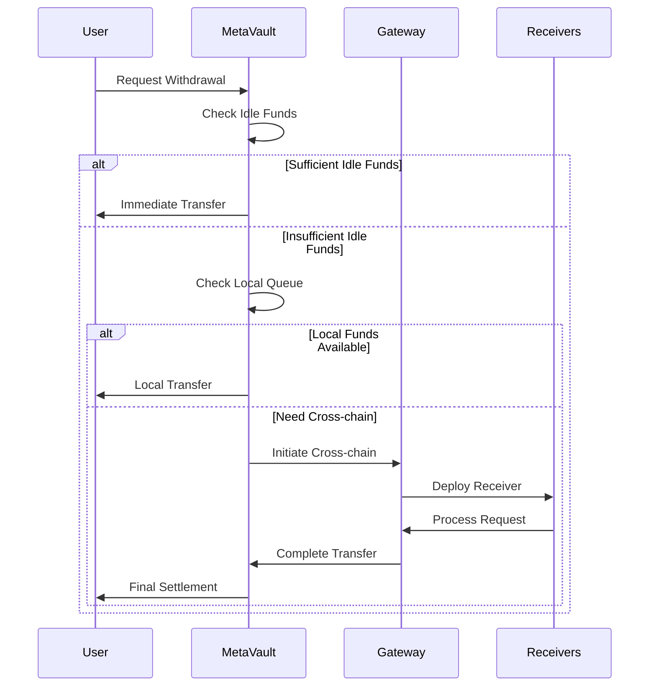

# MetaVault Protocol

> Professional cross-chain yield aggregation protocol built on ERC7540

[](https://opensource.org/licenses/MIT)
[]()

MetaVault is a next-generation yield aggregation protocol that enables efficient cross-chain capital allocation through asynchronous deposits and withdrawals. Built on the ERC7540 standard, it provides a secure and modular architecture for managing assets across multiple blockchain networks.

## Table of Contents

- [Overview](#overview)
- [Architecture](#architecture)
- [Core Features](#core-features)
- [Technical Details](#technical-details)
- [Protocol Flow](#protocol-flow)
- [Getting Started](#getting-started)
- [Testing](#testing)
- [License](#license)

## Overview

MetaVault reimagines cross-chain yield aggregation by implementing:

- ERC7540-compliant asynchronous operations
- Modular proxy architecture for upgradeable components
- Sophisticated withdrawal queue management
- Cross-chain bridging and recovery mechanisms
- Multi-layered fee structure with high watermark

### Protocol Architecture


```mermaid
graph TD
    subgraph User Operations
        User[Users] --> |Deposit/Redeem|MetaVault
    end
    
    subgraph Core Protocol
        MetaVault[MetaVault] --> |Modular Logic|Engine[ERC7540Engine]
        MetaVault --> |Cross-chain Ops|Gateway[SuperformGateway]
        MetaVault --> |Share Price|Oracles[Price Oracles]
    end
    
    subgraph Cross-Chain Infrastructure
        Gateway --> |Recovery|SPR[SuperPositionsReceiver]
        Gateway --> |Request Handling|ERC20R[ERC20Receiver Factory]
        Gateway --> |Bridging|Bridges[Superform]
    end
    
    subgraph Yield Sources
        MetaVault --> |Local|LocalVaults[Same-Chain Vaults]
        MetaVault --> |Remote|RemoteVaults[Cross-Chain Vaults]
    end
```

## Core Features

### Investment Management

#### Vault Operations
- **Investment**: Managers can allocate capital across chains
- **Divestment**: Strategic withdrawal of positions
- **Asset Tracking**: Comprehensive position monitoring

#### Withdrawal Queue System
- Separate queues for local and cross-chain operations
- Priority-based liquidation strategy
- Optimized gas consumption

### User Operations

#### Deposits
- Atomic deposit processing
- Immediate share minting
- Configurable lock-up periods

#### Withdrawals
- Asynchronous redemption mechanism
- Three-tier liquidation strategy:
  1. Idle funds utilization
  2. Local vault liquidation
  3. Cross-chain position unwinding
- Request-specific accounting

## Technical Details

### Smart Contracts

#### MetaVault.sol
```solidity
contract MetaVault is MultiFacetProxy, Multicallable {
    // Core vault functionality
    // Asset management
    // Fee calculations
}
```

#### SuperformGateway.sol
```solidity
contract SuperformGateway {
    // Cross-chain operations
    // Bridge integration
    // Recovery mechanisms
}
```

#### Key Components
- **ERC7540Engine**: Redemption processing logic
- **ERC20Receiver**: Request-specific balance tracking
- **SuperPositionsReceiver**: Cross-chain recovery
- **Price Oracles**: Share price verification

### Fee Structure

#### Performance Fees
- Applied above high watermark
- Configurable rates
- Custom exemptions available

#### Management Fees
- Time-based calculation
- Asset-based pricing
- Flexible fee schedules

#### Oracle Fees
- Cross-chain price updates
- Network-specific rates
- Cost distribution model

## Protocol Flow

### Deposit Flow
1. User deposits assets
2. Shares minted and locked
3. Assets added to idle pool
4. Manager allocates capital

### Withdrawal Flow

```mermaid
sequenceDiagram
    participant User
    participant MetaVault
    participant Gateway
    participant Receivers

    User->>MetaVault: Request Withdrawal
    MetaVault->>MetaVault: Check Idle Funds
    alt Sufficient Idle Funds
        MetaVault->>User: Immediate Transfer
    else Insufficient Idle Funds
        MetaVault->>MetaVault: Check Local Queue
        alt Local Funds Available
            MetaVault->>User: Local Transfer
        else Need Cross-chain
            MetaVault->>Gateway: Initiate Cross-chain
            Gateway->>Receivers: Deploy Receiver
            Receivers->>Gateway: Process Request
            Gateway->>MetaVault: Complete Transfer
            MetaVault->>User: Final Settlement
        end
    end
```

## Getting Started

### Prerequisites

To install Foundry:

```sh
curl -L https://foundry.paradigm.xyz | bash
```

This will download foundryup. To start Foundry, run:

```sh
foundryup
```

To install Soldeer:

```sh
cargo install soldeer
```

### Clone the repo

```sh
git clone https://github.com/UnlockdFinance/metavault.git
```

### Install the dependencies

```sh
soldeer install
```

### Compile

```sh
forge build
```

## Testing

### Run Tests
```bash
# Set test environment
export FOUNDRY_PROFILE=fork

# Unit tests
forge t
```

## License

This project is licensed under the MIT License - see the [LICENSE.md](LICENSE.md) file for details.